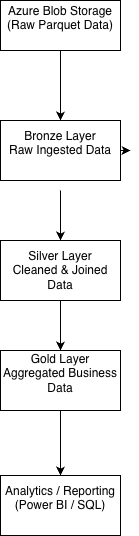

# Project 1 – Azure Databricks Medallion Architecture Pipeline

## 📌 Overview
This project demonstrates an **end-to-end data engineering pipeline** built using **Azure Databricks**, **PySpark**, and **Delta Lake**, following the **Medallion Architecture** pattern.

The pipeline processes raw retail data through **Bronze**, **Silver**, and **Gold** layers to produce **analytics-ready datasets** suitable for reporting and business insights.

This project focuses on:
- Real-world data transformations
- Schema enforcement using Delta Lake
- Clean and maintainable pipeline design

---

## 🏗 Architecture Diagram

**High-level flow:**

Azure Blob Storage → Bronze → Silver → Gold → Analytics / Reporting

All transformations are executed using **Azure Databricks (PySpark + Delta Lake)**.

---

## 🥉 Bronze Layer (Raw Data)
**Purpose:**  
Store raw ingested data with minimal or no transformations.

**Details:**
- Source: Azure Blob Storage
- Format: Parquet
- Data Entities:
  - Transactions
  - Products
  - Stores
  - Customers
- No schema enforcement or cleaning

**Goal:** Preserve original data for traceability and reprocessing.

---

## 🥈 Silver Layer (Cleaned & Enriched Data)
**Purpose:**  
Create a clean, structured, and enriched dataset.

**Transformations applied:**
- Explicit schema casting
- Deduplication of customer records
- Joining transactions with products, stores, and customers
- Derived column: `total_amount = quantity × price`

**Storage:**
- Delta Lake format
- Enforced schema
- Versioned path used to handle schema evolution safely

**Outcome:**  
A single, reliable dataset ready for analytics and aggregation.

---

## 🥇 Gold Layer (Business Aggregations)
**Purpose:**  
Provide business-ready aggregated data optimized for reporting.

**Aggregations include:**
- Total quantity sold
- Total sales amount
- Grouped by:
  - Transaction date
  - Product
  - Category
  - Store
  - Location

**Storage:**
- Delta Lake tables
- Optimized for SQL queries and BI tools

**Outcome:**  
Final datasets consumable by reporting tools such as Power BI.

---

## 📂 Project Structure

